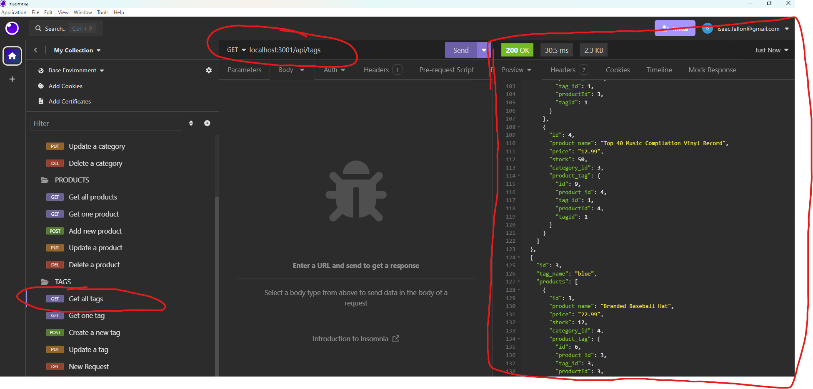
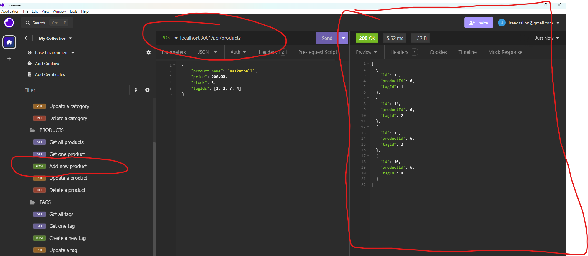

# 13-Challenge-E-commerce-Back-End

        
## Description
            
This project is an E-commerce Back-End application which takes a working Express.js API and configures it to use [Sequelize](https://sequelize.org/) to interact with a [PostgreSQL](https://www.postgresql.org/) database.

I built this application as a way to manage data in a complex database spread throughout several relational tables. By using this application within the context of a fake "E-commerce store", we can use the API client [Insomnia](https://insomnia.rest/) to either view, add, update or delete data to reflect the store's stock of items. 

By completing this project, I expanded my knowledge of SQL database logic and the benefits of using Sequelize to create it as opposed to the standard SQL language. 

### Video walkthrough showing application functionality:

To view a video walkthrough of how to initialise the database, seed the data and access the data via its API routes using Insomnia, watch [a video demonstration here](https://drive.google.com/file/d/11Bm-GAol6_m6TaQyZ9pbrfdVX-BeEbIb/view?usp=sharing). 

### Screenshots of using the application's API routes to manage data:

The screenshots below show the application's API routes being called in Insomnia to return certain data.  

- GET route to display all tags:

- POST route to add a new product

To understand how all routes work, watch the full video walkthrough linked above or [here](https://drive.google.com/file/d/11Bm-GAol6_m6TaQyZ9pbrfdVX-BeEbIb/view?usp=sharing). 
            
## Table of Contents
            
- [Installation](#installation)
- [Usage](#usage)
- [License](#license)
- [Contributing](#contributing)
- [Tests](#tests)
- [Questions](#questions)
            
## Installation

To install this application, you'll need to clone the repository to your local machine. [Refer to this guide from GitHub if you need help.](https://docs.github.com/en/repositories/creating-and-managing-repositories/cloning-a-repository/)

Once cloned, you will need to navigate to the project's folder in your terminal and run the following command to install the necessary dependencies: `npm install`.

Next, you will need PostgreSQL installed on your computer to initialise the database. [Visit PostgreSQL's website for links to download and installation instructions.](https://www.postgresql.org/)

Lastly, you'll also need to install the API client Insomnia, which you can do by [visiting their website here](https://insomnia.rest/). 
            
## Usage

Once all of the steps in [Installation](#installation) have been completed, you will firstly need to initialise the 'ecommerce_db' database and seed data into it. To do so, enter the following commands once navigated to the project folder in your terminal:

1. `psql -U postgres` - This will start PostgreSQL. Enter your password if you set one up. 
2. `\i db/schema.sql` - To set up the 'employee_db' database. 
3. Close out of postgres by entering `Control + c`.

Next, seed the data by entering the following once navigated to the project folder in your terminal:

4. `node seeds/index.js`

Then, you can run the server locally by entering the following:

5. `node server.js`.

6. If everything was installed and run correctly, you should be able to test the API routes using Insomnia now. Check the [walkthrough video here to see how you can view, add, update or delete data using these routes.](https://drive.google.com/file/d/11Bm-GAol6_m6TaQyZ9pbrfdVX-BeEbIb/view?usp=sharing)
            
## License
            
MIT License

Copyright (c) 2024 isaacfallon
            
Permission is hereby granted, free of charge, to any person obtaining a copy
of this software and associated documentation files (the "Software"), to deal
in the Software without restriction, including without limitation the rights
to use, copy, modify, merge, publish, distribute, sublicense, and/or sell
copies of the Software, and to permit persons to whom the Software is
furnished to do so, subject to the following conditions:
            
The above copyright notice and this permission notice shall be included in all
copies or substantial portions of the Software.
            
THE SOFTWARE IS PROVIDED "AS IS", WITHOUT WARRANTY OF ANY KIND, EXPRESS OR
IMPLIED, INCLUDING BUT NOT LIMITED TO THE WARRANTIES OF MERCHANTABILITY,
FITNESS FOR A PARTICULAR PURPOSE AND NONINFRINGEMENT. IN NO EVENT SHALL THE
AUTHORS OR COPYRIGHT HOLDERS BE LIABLE FOR ANY CLAIM, DAMAGES OR OTHER
LIABILITY, WHETHER IN AN ACTION OF CONTRACT, TORT OR OTHERWISE, ARISING FROM,
OUT OF OR IN CONNECTION WITH THE SOFTWARE OR THE USE OR OTHER DEALINGS IN THE
SOFTWARE.
            
## Contributing

N/A
            
## Tests

N/A
     
## Questions
            
If you have any questions, please reach out at either of the following:
            
### GitHub profile:
- https://github.com/isaacfallon

### Email:
- isaac.fallon@gmail.com
